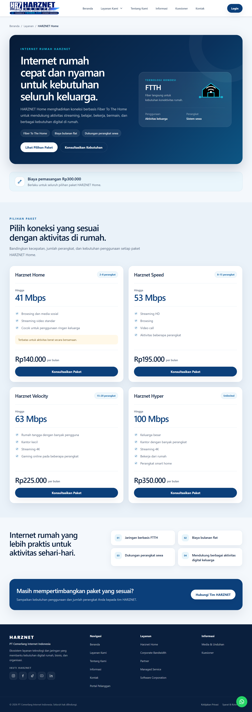
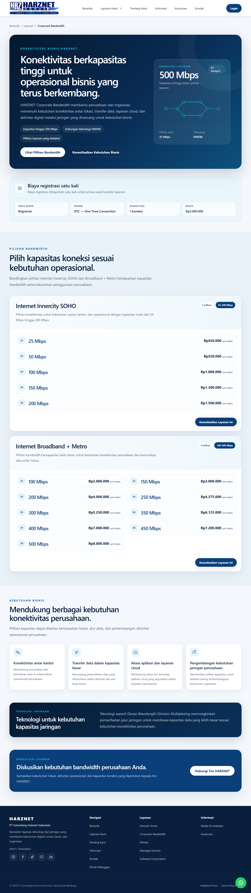
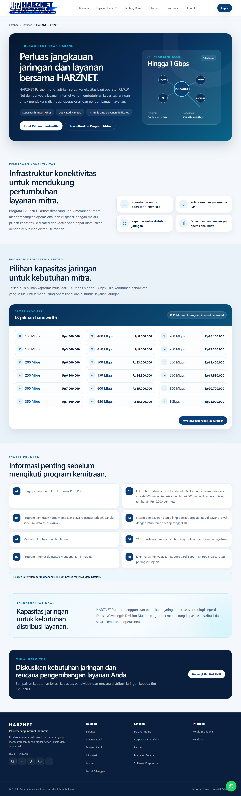
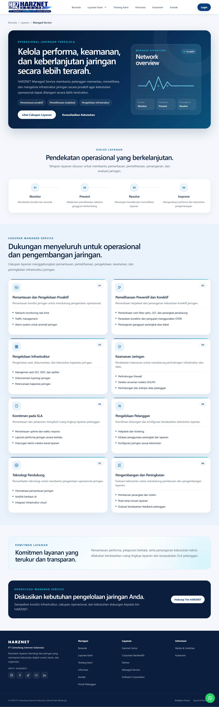
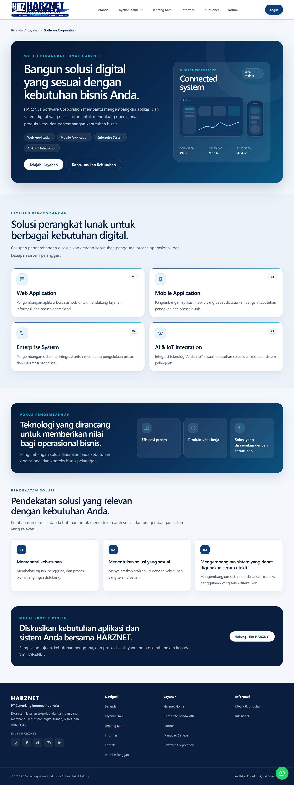
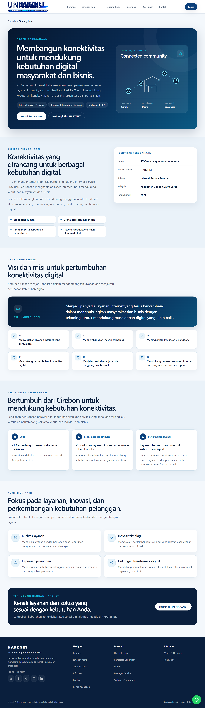
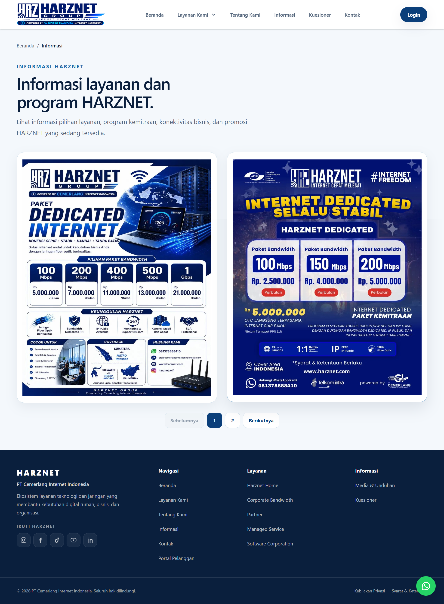
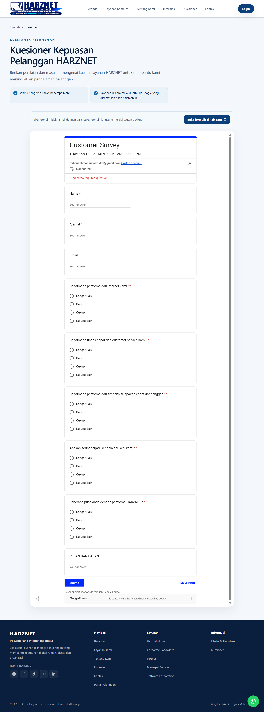

# HARZNET Company Profile

HARZNET Company Profile is a public-facing company profile website built with Next.js to present business information, internet services, service coverage, brand identity, and contact access in a modern and responsive interface.

The website is designed to help visitors understand HARZNET’s company profile, available services, coverage information, business identity, and contact channels across desktop and mobile devices.

## System Overview

This project is a public company profile and marketing website for HARZNET. It contains a landing page, service detail pages, company information pages, supporting information pages, contact access, and basic SEO configuration.

The content structure is arranged to make service information easier to explore, including residential internet service, corporate bandwidth, partnership opportunities, managed services, and software corporation information.

## Developer Role

The development responsibilities in this project included:

- Analyzing company profile content requirements and public website structure.
- Structuring website pages so visitors can clearly understand the company, services, coverage, and contact information.
- Developing the frontend website using Next.js, React, TypeScript, and Tailwind CSS.
- Creating responsive layouts for desktop and mobile devices.
- Preparing reusable layout, page, and section components.
- Setting up project structure, README documentation, and basic development configuration.
- Adjusting components, layout, and website sections based on company profile needs.
- Preparing screenshot documentation for portfolio presentation.

## Tech Stack

### Frontend

- Next.js 16 with App Router
- React 19
- TypeScript

### Styling

- Tailwind CSS 4
- Global CSS
- CSS Modules for selected component styling

### Testing & Quality

- ESLint
- Prettier
- Vitest
- Testing Library
- Playwright

### Tools

- pnpm
- Git

## Main Features

- Company profile landing page with hero section, company information, service summary, testimonials, and call-to-action.
- Service detail pages for HARZNET Home, Corporate Bandwidth, Partner, Managed Service, and Software Corporation.
- Public pages for company information, information articles, downloadable media, contact, questionnaire, privacy policy, and terms and conditions.
- Contact form with validation and SMTP-based email configuration.
- Desktop navigation, mobile navigation, service dropdown, footer, and WhatsApp contact button.
- Responsive layout for multiple screen sizes.
- Page metadata, sitemap, and robots configuration for basic SEO needs.
- Not-found page and application error handling.

## Page Coverage

The website includes the following main public sections:

- Home / Landing Page
- HARZNET Home
- Corporate Bandwidth
- Partner
- Managed Service
- Software Corporation
- About Us
- Information
- Questionnaire
- Contact
- Privacy Policy
- Terms and Conditions

## Project Structure

```text
harznet-company-profile/
|-- docs/                 # Technical and development documentation
|-- e2e/                  # End-to-end testing with Playwright
|-- public/
|   `-- images/           # Public image assets
|-- src/
|   |-- actions/          # Server actions, including contact form submission
|   |-- app/              # Routes, layout, metadata, sitemap, and robots
|   |-- components/       # Reusable UI, layout, page, and section components
|   |-- config/           # Public website configuration
|   |-- content/          # Local typed content
|   |-- features/         # Feature or domain-based modules
|   |-- lib/              # Helpers, validation, email, and SEO utilities
|   |-- services/         # Public service adapters
|   |-- test/             # Testing setup and fixtures
|   `-- types/            # Shared types and interfaces
|-- .env.example          # Environment configuration example
|-- package.json          # Dependencies and scripts
|-- pnpm-lock.yaml        # pnpm lockfile
|-- next.config.ts        # Next.js configuration
`-- README.md             # Project documentation
```

## Screenshots

### Home


### HARZNET Home



### Corporate Bandwidth



### Partner



### Managed Service



### Software Corporation



### About Us



### Information



### Questionnaire



## Requirements

Make sure the local development environment has:

- Node.js compatible with Next.js 16
- pnpm 10
- Git

## Installation

Clone the repository:

```bash
git clone https://github.com/raihanachmadsuhadadev/harznet-company-profile.git
cd harznet-company-profile
```

Install dependencies:

```bash
pnpm install
```

## Environment Example

Copy `.env.example` to `.env.local`, then fill in the required configuration based on the local or deployment environment.

```env
SMTP_HOST=
SMTP_PORT=465
SMTP_SECURE=true
SMTP_USER=
SMTP_PASS=

CONTACT_EMAIL_FROM=
CONTACT_EMAIL_TO=

CONTACT_MAP_EMBED_URL=
```

The `SMTP_*` and `CONTACT_EMAIL_*` variables are used for contact form email delivery. `CONTACT_MAP_EMBED_URL` is used to display a map in the contact section when a valid URL is available.

Never commit credentials or expose private values through public environment variables.

## Running the Application

Run the development server:

```bash
pnpm dev
```

Open the application in the browser:

```text
http://localhost:3000
```

## Build

Create a production build:

```bash
pnpm build
```

Run the production build locally:

```bash
pnpm start
```

## Testing

Run unit or integration tests:

```bash
pnpm test
```

Run end-to-end tests if the Playwright setup is available:

```bash
pnpm playwright test
```

If script names differ, check `package.json` for the available commands.

## Project Status

**Completed**

This project has been completed as a Next.js company profile website with a landing page, service pages, supporting public pages, contact channel, responsive layout, screenshot documentation, and basic SEO structure.

## Future Improvements

Potential improvements include:

- Further SEO metadata refinement.
- Image performance optimization.
- Content management integration.
- Analytics integration.
- Contact form delivery monitoring.
- Accessibility improvements.
- Deployment configuration refinement.
- Responsive testing across more device sizes.

## Project Scope

This project focuses on a public company profile and marketing website.

It intentionally does not include customer login, billing, ISP management dashboard, customer portal, payment features, or operational ISP system workflows.

## Purpose

This project was developed as a portfolio and company profile project to demonstrate skills in Next.js frontend development, responsive UI implementation, content structuring, SEO preparation, public website development, and professional project documentation.
